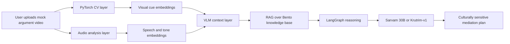

# Bento

Production-grade reference architecture for a high-end Indian-market relationship wellness platform with PyTorch CV, multimodal reasoning, vernacular-first LLMs, and low-latency inference.

## Stack

### 1. Core AI Engine
- **PyTorch** for all custom modeling and inference integration.
- **CV detection:** MTCNN or MediaPipe-based face and landmark extraction.
- **Emotion recognition:** MER-CLIP or fine-tuned EfficientNet-V2 for micro-expression and stress cues.
- **Temporal understanding:** VideoMAE for posture, defensiveness, and closeness analysis.
- **VLM layer:** Sarvam Vision 3B and LLaVA-OneVision 1.5 for visual reasoning over screenshots, photos, and session context.

### 2. Conversational Brain
- **Foundation LLM:** Sarvam 30B or Krutrim-v1 for code-mixed Indian languages and regional nuance.
- **Orchestration:** LangGraph for cyclic reasoning, policy checks, and framework-aware response generation.

### 3. Speech and Audio
- **STT:** Saaras V3 or Whisper-v3.
- **Audio emotion:** Wav2Vec2 or HuBERT fine-tuned for tone, sarcasm, and aggression detection.

### 4. Data and Context
- **Vector DB:** Milvus or Qdrant for multimodal embeddings and retrieval.
- **Normalization:** Open Vernacular AI Kit for Hinglish and code-switch preprocessing.

### 5. Production and Delivery
- **Inference optimization:** TensorRT-LLM or vLLM.
- **Backend:** FastAPI with async workers.
- **Frontend:** Flutter for mobile, Next.js for web.
- **Demo layer:** Streamlit for fast technical validation.

## Proof of Skill Architecture Map

## Recommended Request Flow
1. Ingest video, audio, and optional text/chat context.
2. Run CV and audio preprocessing in PyTorch.
3. Normalize code-mixed text with Open Vernacular AI Kit.
4. Retrieve domain scripts and mediation patterns from the vector store.
5. Route through LangGraph for policy, safety, and reasoning.
6. Generate the final response with the vernacular-first LLM.

## Production Notes
- Keep all vision and audio models as isolated services so they can scale independently.
- Use a retrieval cache for repeated family-therapy or mediation prompts.
- Add guardrails for sensitive relationship advice and crisis detection.
- Benchmark latency separately for STT, CV, retrieval, and generation.

## Hiring Signal
This architecture signals:
- Native PyTorch execution instead of wrapper-only usage.
- Multimodal reasoning across video, audio, and text.
- Indian-language competence instead of English-only defaults.
- Real production thinking through low-latency inference and retrieval.

